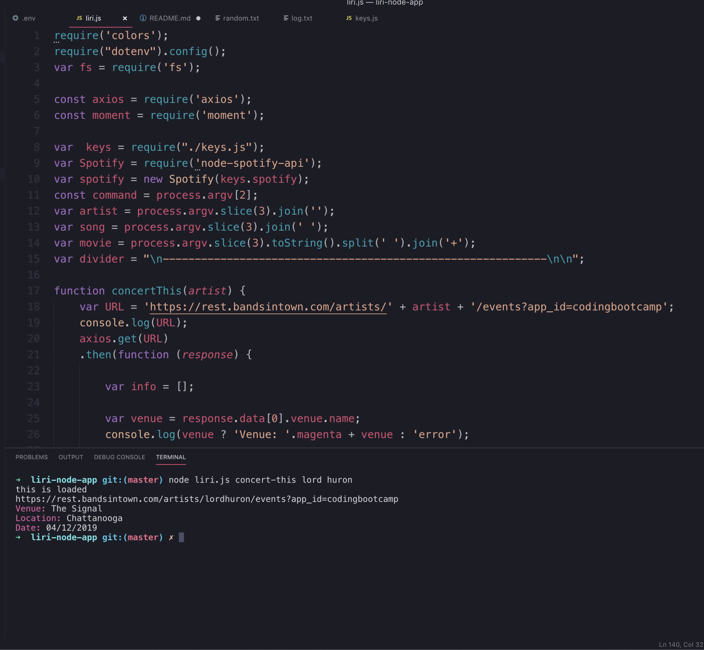
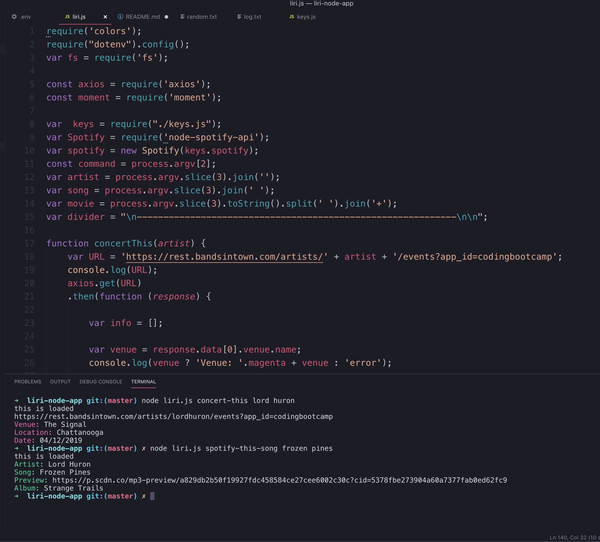
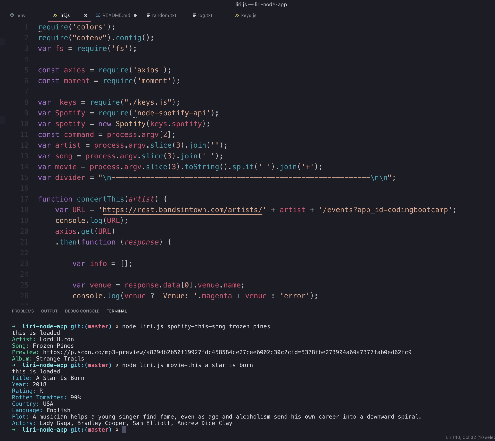

# liri-node-app

## Overview

In this assignment, you will make LIRI. LIRI is like iPhone's SIRI. However, while SIRI is a Speech Interpretation and Recognition Interface, LIRI is a _Language_ Interpretation and Recognition Interface. LIRI will be a command line node app that takes in parameters and gives you back data.

LIRI responds to four commands: 'concert-this', 'spotify-this-song', 'movie-this', and 'do-what-it-says.' It will call a function based on which command and parameters are entered to obtain the information from one of the API's.

## Technology
 
* javascript
* node.js
* npm
* axios
* Spotify API
* Bands In Town API
* OMDB API

## Images

